# Sugira Mobile App User Guide

## Table of Contents
1. [Authentication Flow](#authentication-flow)
2. [Main Navigation](#main-navigation)
3. [Family Management](#family-management)
4. [Project Management](#project-management)
5. [Statistics and Monitoring](#statistics-and-monitoring)
6. [Settings and User Profile](#settings-and-user-profile)
7. [Video Management](#video-management)
8. [Community Section](#community-section)

## Authentication Flow

### Login Screen
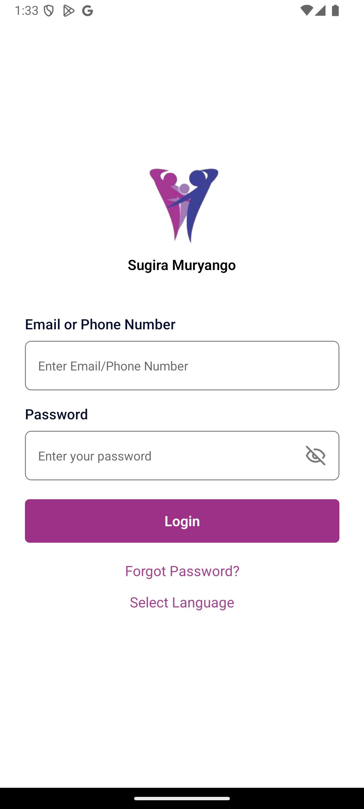

The app starts with the login screen where users can:
- Enter their credentials
- Access the forgot password feature
- Navigate to the main application after successful authentication

### Forgot Password
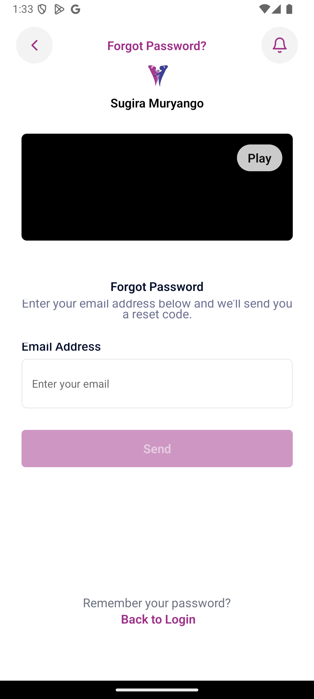

If users forget their password, they can:
- Request a password reset
- Follow the verification process
- Set up a new password

### PIN Authentication
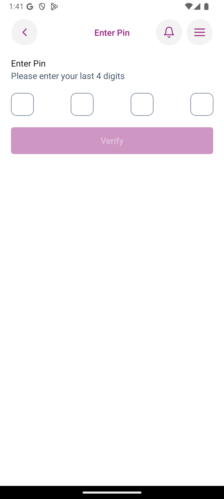

For security purposes, certain sections of the app require PIN authentication:
- Enter the last 4 digits of your phone number
- This acts as a secondary security layer
- Required before accessing sensitive information

## Main Navigation

### App Menu
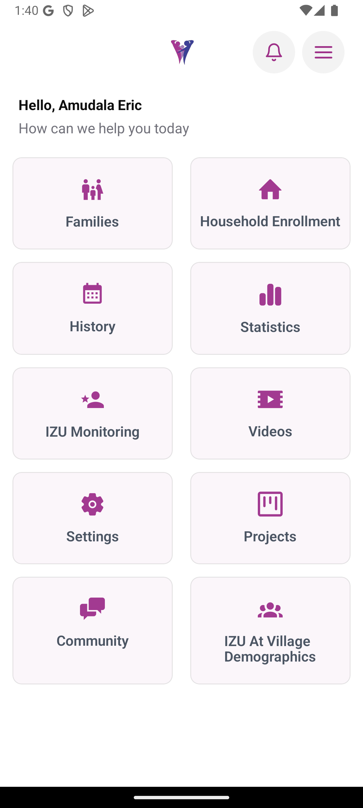

The main menu provides access to all major features:
- Family Management
- Projects
- Statistics
- Videos
- Community
- Settings

### Sidebar Menu
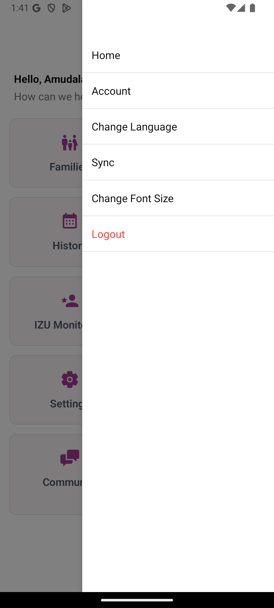

The sidebar offers quick access to:
- Home
- Sync
- History
- Settings
- Other navigation options

### Sync Page
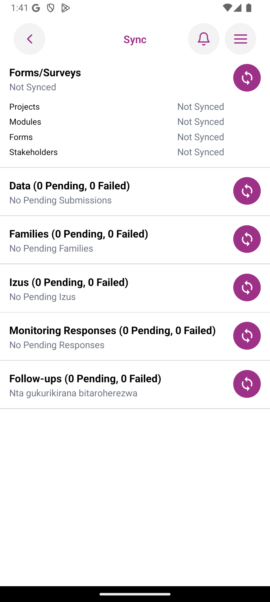

The sync page allows users to:
- View sync status
- Manually trigger synchronization
- Monitor sync progress
- Ensure data consistency

## Family Management

### Family Modules
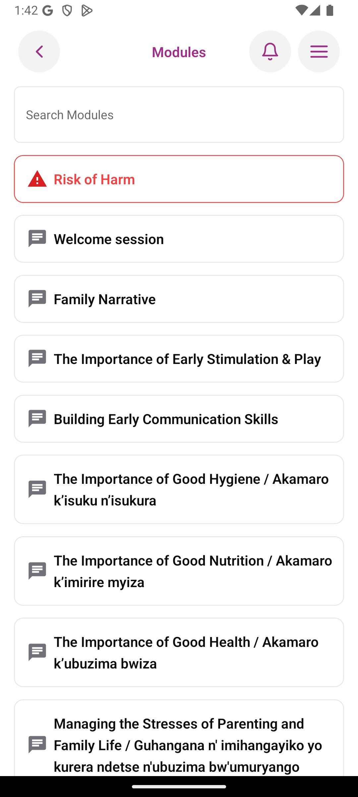

Access family-related modules:
- View available modules
- Select specific modules
- Track progress

### Forms and Inputs
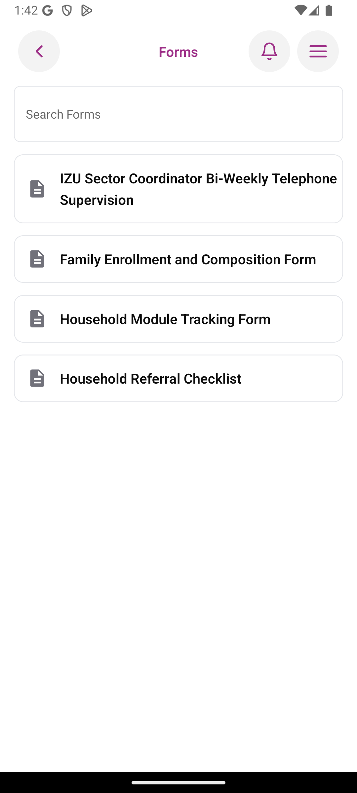

Complete family-related forms:
- Fill out required information
- Submit data
- Track submission status

### Family Enrollment
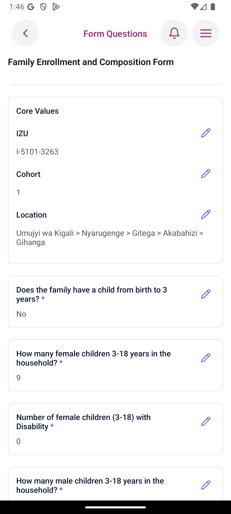

Process for enrolling new families:
1. Select location
2. Fill enrollment form
3. Preview information
4. Submit enrollment

## Project Management

### Projects Screen
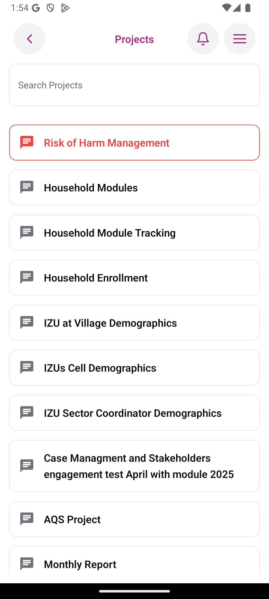

Manage projects:
- View all projects
- Access project details
- Track project progress

### Project Modules

Work with project modules:
- Select specific modules
- Complete module tasks
- Track completion status

## Statistics and Monitoring

### IZU Statistics
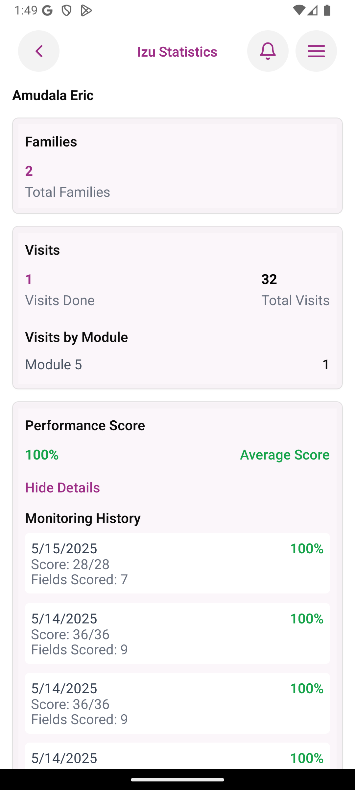

View comprehensive statistics:
- Overall performance metrics
- IZU-specific data
- Progress tracking

### IZU Score Details
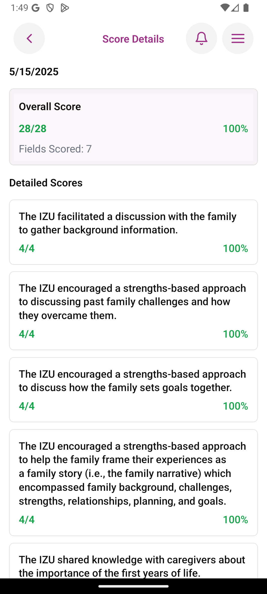

Detailed score breakdown:
- Performance metrics
- Scoring details
- Historical data

## Settings and User Profile

### Settings Screen
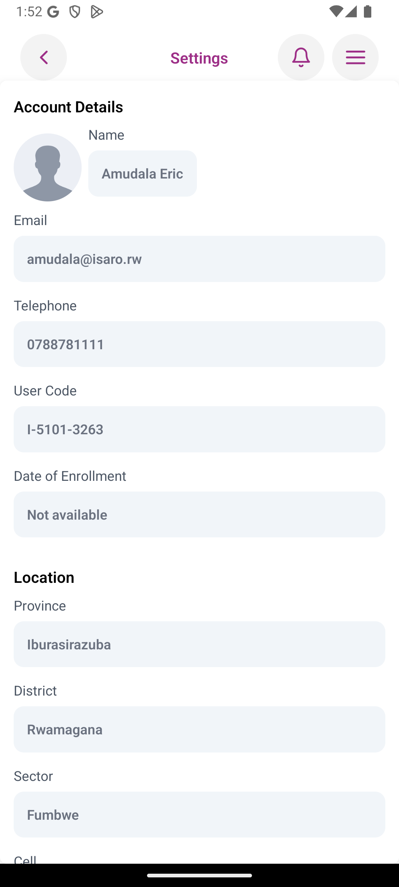

Manage app settings:
- User profile information
- App preferences
- System settings

### Language Settings
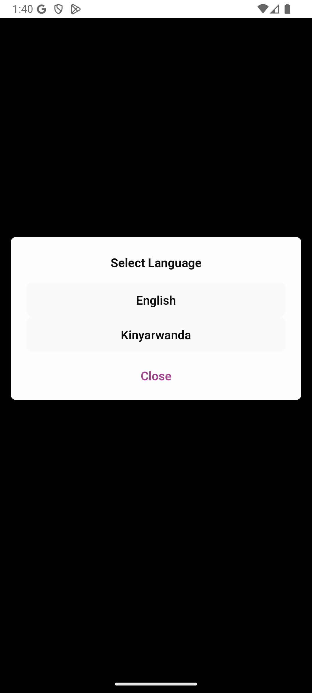

Customize language preferences:
- Select preferred language
- Apply changes
- View available options

## Video Management

### Video List
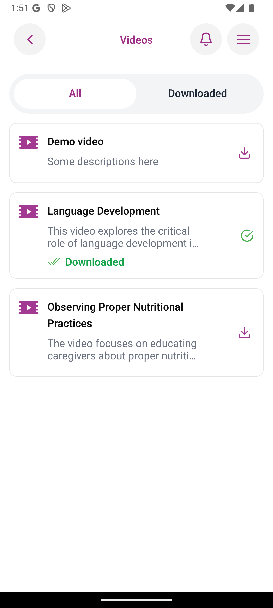

Access video content:
- View available videos
- Download videos
- Manage video content

### Video Preview

Watch and manage videos:
- Play video content
- Control playback
- Access video details

## Community Section

### Community Screen
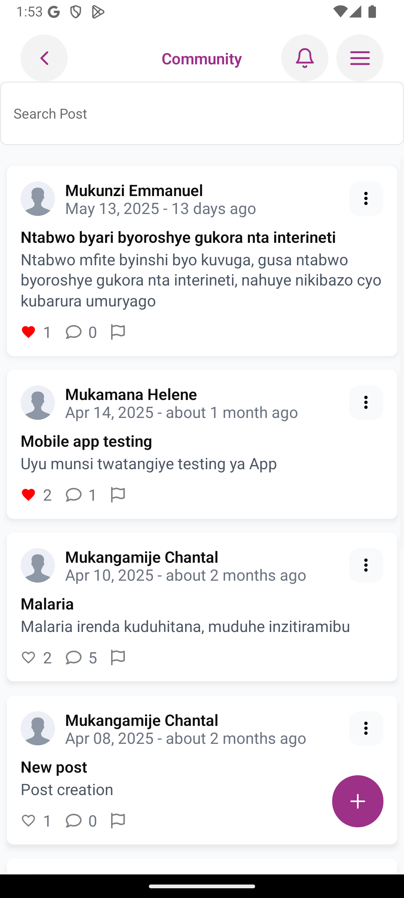

Engage with the community:
- View community posts
- Interact with content
- Share information

### Post Details
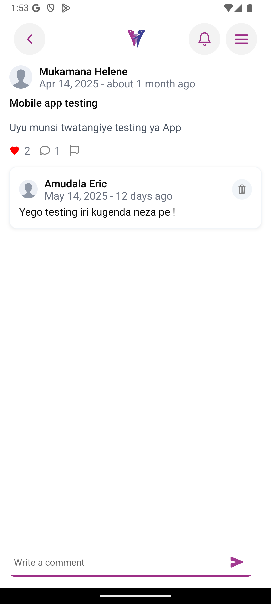

View and interact with posts:
- Read post content
- View comments
- Engage with community members

## History and Submissions

### Saved History
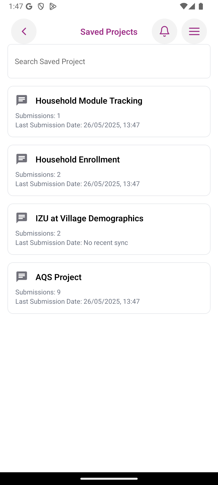

Access submission history:
- View past submissions
- Track submission status
- Access detailed information

### Submissions List
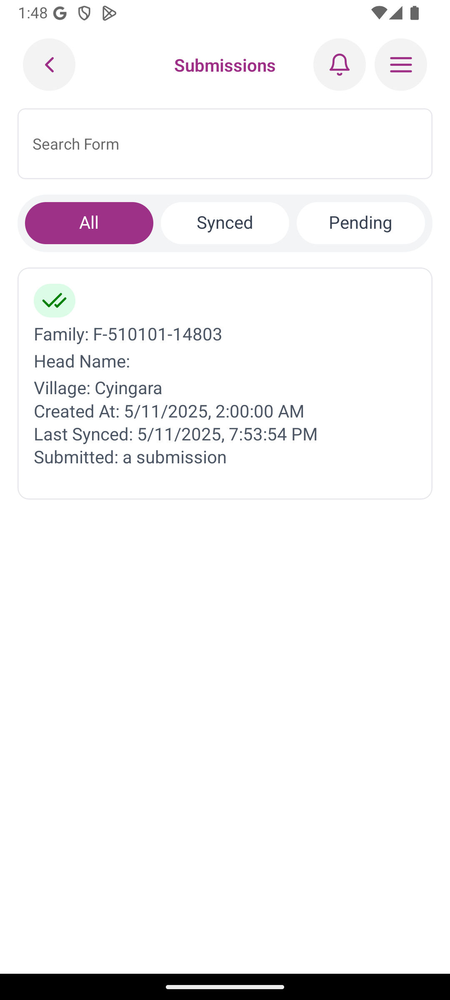

Manage submissions:
- View all submissions
- Track submission status
- Access submission details

### Submission Details
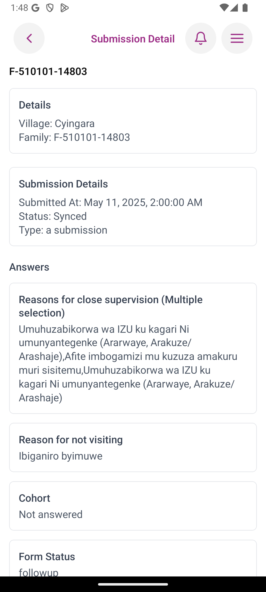

View detailed submission information:
- Submission content
- Status information
- Related data 